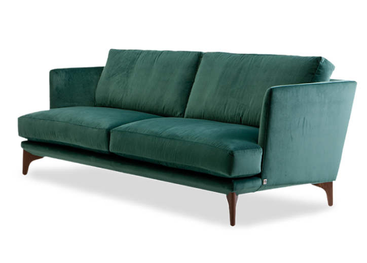

<div align="center">

<h1>Furni</h1>

<p><strong>Адаптивный лендинг студии современного интерьера и мебели</strong></p>


</div>

<p align="center">
  
</p>

Furni — одностраничный сайт для интерьерной студии или мебельного бренда. Лендинг построен на чистых HTML, CSS и JavaScript: без фреймворков, сборщиков и сторонних UI-библиотек.

## Возможности

| Раздел | Что реализовано |
|---|---|
| Навигация | Плавный скролл к разделам, подсветка активного пункта и скрывающаяся при прокрутке шапка. |
| Адаптивность | Мобильное бургер-меню и брейкпоинты для планшетов и телефонов. |
| Каталог | Карточки товаров, кнопки перехода к каталогу и короткая анимация выбранных товаров. |
| Отзывы | Карусель из 8 отзывов с кнопками «вперёд/назад» и индикаторами. |
| Подписка | Проверка имени и email в форме рассылки с понятными toast-уведомлениями. |
| Анимации | Плавное появление блоков при прокрутке; учитывается системная настройка `prefers-reduced-motion`. |

## Технологии

- **HTML5** — семантическая структура лендинга.
- **CSS3** — адаптивная вёрстка, анимации, дизайн-токены и стили компонентов.
- **Vanilla JavaScript** — интерактивные элементы, карусель, scrollspy и валидация формы.
- **Google Fonts** — шрифты Fraunces и Manrope.

## Запуск

Проект не требует установки зависимостей или сборки.

1. Распакуйте архив или клонируйте репозиторий.
2. Откройте `index.html` в браузере.

Для локальной разработки удобнее запустить простой сервер из корня проекта:

```bash
python -m http.server 8000
```

Затем откройте [http://localhost:8000](http://localhost:8000) в браузере.

## Структура проекта

```text
.
├── index.html          # разметка всех секций лендинга
├── script.js           # интерактивность и клиентская логика
├── styles/
│   ├── reset.css       # сброс стандартных стилей браузера
│   └── style.css       # дизайн, адаптивность и анимации
└── imgs/               # изображения товаров, интерьеров и иконки
```

## Что есть на странице

- Первый экран с призывами к действию.
- Карточки популярных товаров.
- Блок преимуществ сервиса и коллаж интерьеров.
- Подборка товаров и слайдер отзывов.
- Блог, форма подписки и футер с навигацией.

## Настройка

| Что изменить | Где искать |
|---|---|
| Тексты, названия товаров, цены и ссылки | `index.html` |
| Отзывы, уведомления, прокрутка и форма | `script.js` |
| Цвета, шрифты, размеры и брейкпоинты | `styles/style.css` — блок `:root` и медиазапросы |
| Фотографии и иконки | папка `imgs/` |

## Важно

Это демонстрационный фронтенд. Форма подписки показывает уведомление в браузере, но не отправляет данные на сервер. Ссылки на соцсети, поддержку, вакансии и правовые страницы пока ведут на заглушки — перед публикацией сайта их следует заменить на реальные URL и подключить серверную часть формы.

---

<p align="center">Сделано для демонстрации современного мебельного бренда.</p>